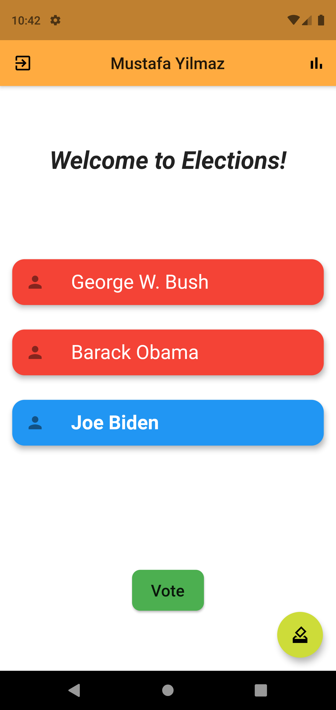

# Voting Application

This repo contains the voting application's source code. The application was written in Flutter. To see backend code, you can look [here](https://github.com/VoteAppBlockchain/voting-app-backend). 

## Tech Stack

* Mobile - [Flutter](https://github.com/flutter/flutter)
* Backend - [Node.Js](https://github.com/nodejs/node)
* Database - [PostgreSQL](https://github.com/postgres/postgres)
* Ethereum JavaScript API - [Web3.Js](https://github.com/ChainSafe/web3.js/)
* Smart Contract - [Solidity](https://github.com/ethereum/solidity)

## Screenshots

  
  
  
  
  

## Team Members 

* Gökhan Özeloğlu - [GitHub](https://github.com/gozeloglu)
* Burak Yılmaz - [GitHub](https://github.com/SBurakYlmaz)
* Dilara İşeri - [GitHub](https://github.com/iseridilara)
